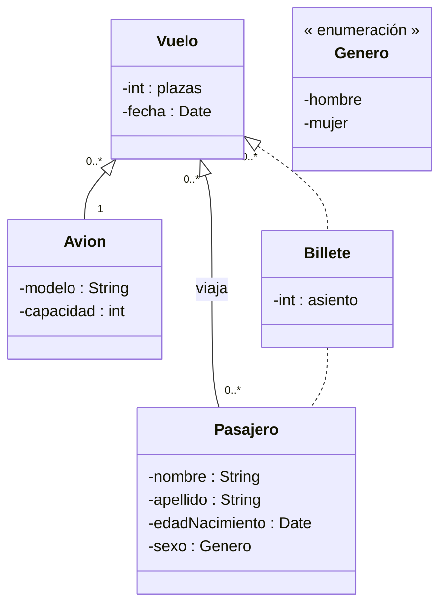

```mermaid
classDiagram
    Vuelo "0..*"<|--"1" Avion
    Vuelo "0..*"<|.. Billete
    Vuelo "0..*"<|--"0..*" Pasajero : viaja
    Billete .. Pasajero
    

    class Vuelo{
      -int : plazas
      -fecha : Date
    }

    class Genero {
        << enumeración >>
        -hombre
        -mujer
    }
    class Billete{
        -int : asiento
    }

    class Pasajero{
        -nombre : String
        -apellido : String
        -edadNacimiento : Date
        -sexo : Genero
        
    }

    class Avion{
        -modelo : String
        -capacidad : int
    }

    

```