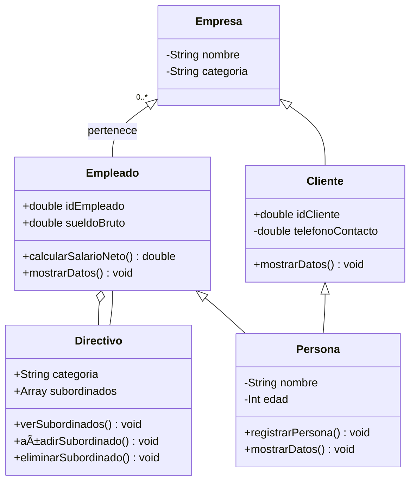

```mermaid
classDiagram
    Empresa "0..*"<|-- Empleado : pertenece
    Empleado o-- Directivo
    Directivo -- Empleado
    Empresa <|-- Cliente
    Empleado <|-- Persona
    Cliente <|-- Persona
    
    class Empresa{
        -String nombre
        -String categoria
        
    }

    class Directivo{
        +String categoria
        +Array subordinados
        +verSubordinados() void
        +añadirSubordinado() void
        +eliminarSubordinado() void

    }

    class Empleado{
        +double idEmpleado
        +double sueldoBruto
        +calcularSalarioNeto() double
        +mostrarDatos() void

    }
	
    class Cliente{
        +double idCliente
        -double telefonoContacto
        +mostrarDatos() void
    }

    class Persona{
        -String nombre
        -Int edad
        +registrarPersona() void
        +mostrarDatos() void

    }


```	