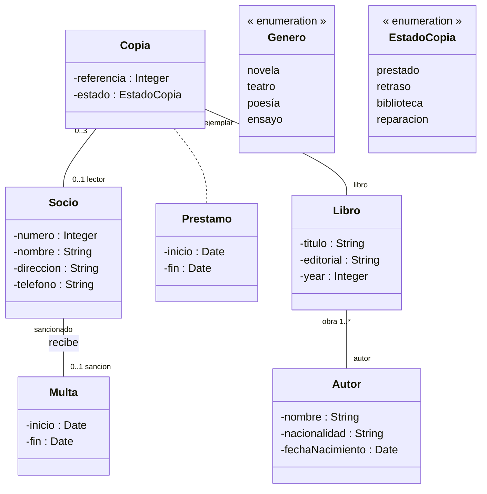

```mermaid
	classDiagram

	Copia "0..3" -- "0..1 lector" Socio

	Copia .. Prestamo

	Copia "1..* ejemplar" -- "libro" Libro

	Libro "obra 1..*" -- "autor" Autor

	Socio "sancionado" -- "0..1 sancion" Multa : recibe

	class Copia {
		-referencia : Integer
		-estado : EstadoCopia
	}

	class Libro {
		-titulo : String
		-editorial : String
		-year : Integer
	}

	class Autor {
		-nombre : String
		-nacionalidad : String
		-fechaNacimiento : Date
	}

	class Prestamo {
		-inicio : Date
		-fin : Date
	}

	class Socio {
		-numero : Integer
		-nombre : String
		-direccion : String
		-telefono : String
	}

	class Multa {
		-inicio : Date
		-fin : Date
	}

	class Genero {
		<< enumeration >>
		novela
		teatro
		poesía
		ensayo
	}

	class EstadoCopia {
		<< enumeration >>
		prestado
		retraso
		biblioteca
		reparacion
	}
```