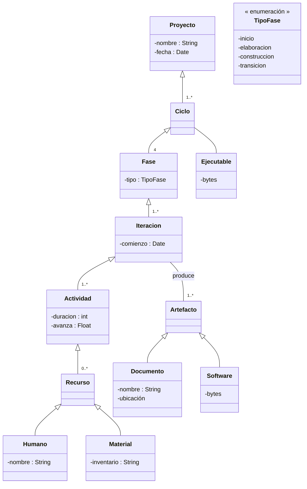

```mermaid
classDiagram
    Proyecto <|--"1..*" Ciclo
    Ciclo <|--"4" Fase
    Fase <|--"1..*" Iteracion
    Iteracion <|--"1..*" Actividad
    Actividad <|--"0..*" Recurso
    Recurso <|-- Humano
    Recurso <|-- Material
    Iteracion --"1..*" Artefacto : produce
    Artefacto <|-- Documento
    Artefacto <|-- Software
    Ciclo -- Ejecutable

    class Proyecto{
      -nombre : String
      -fecha : Date
    }

    class TipoFase {
        << enumeración >>
        -inicio
        -elaboracion
        -construccion
        -transicion
    }

    class Ejecutable{
        -bytes
    }

    class Fase{
        -tipo : TipoFase
    }

    class Iteracion{
        -comienzo : Date
    }

    class Actividad{
        -duracion : int
        -avanza : Float
    }

    class Documento{
        -nombre : String
        -ubicación
    }

    class Software{
        -bytes
    }

    class Humano{
        -nombre : String
    }

    class Material{
        -inventario : String
    }

```